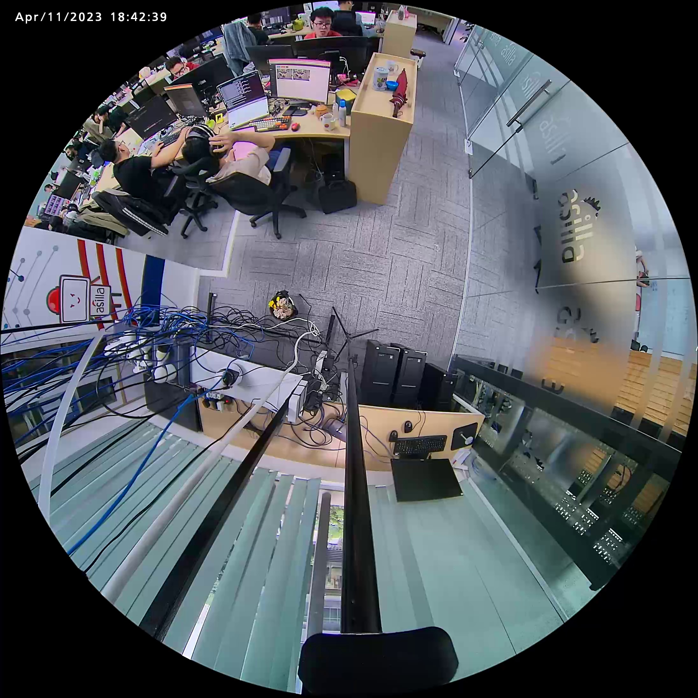
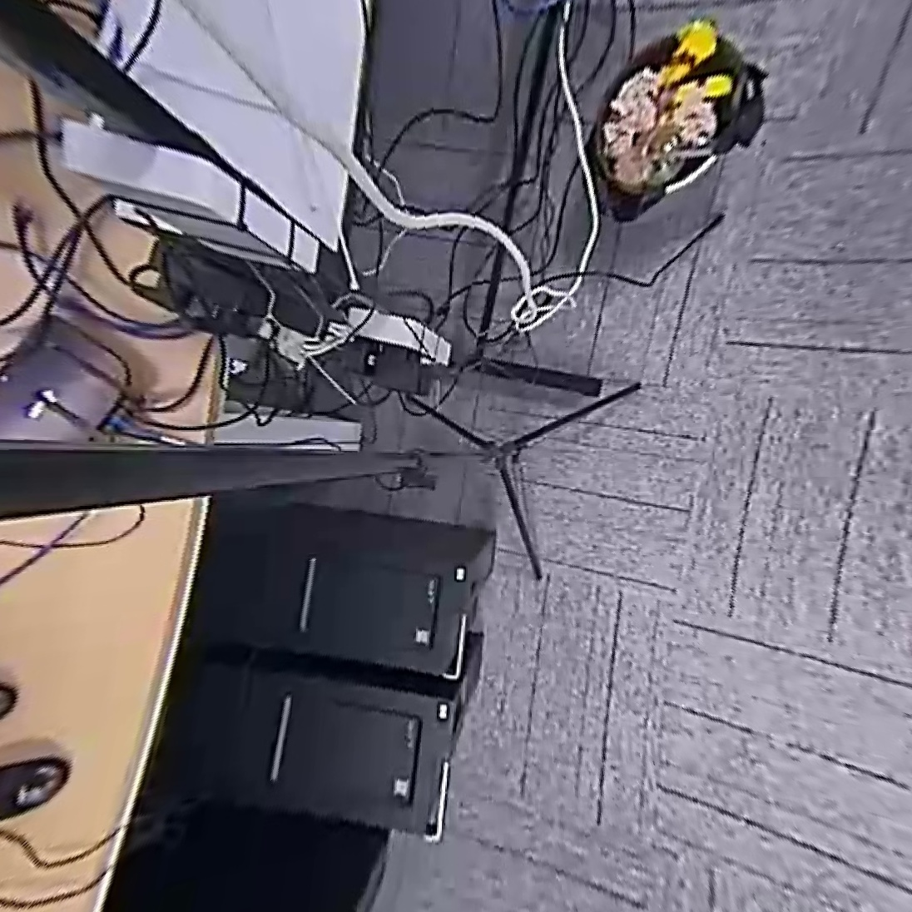

# FisheyeToFlatImage
Fisheye -> Panorama -> Cubemap + Part Panorama

# Requirements

### Install Opencv 

```python
git clone --depth=1 -b 4.7.0 https://github.com/opencv/opencv
cd opencv
mkdir build && cd build
cmake -D CMAKE_INSTALL_PREFIX=/usr ..
make -j$(nproc)
sudo make install
sudo make install
```

# Usage

### Build

```python 
mkdir build && cd build && cmake .. && make
```

### Test 

```python
cd build 
./convert
```

# Results

Input Fisheye
<!--  -->


Output Part Panorama + Cubemap



<!-- 
 -->